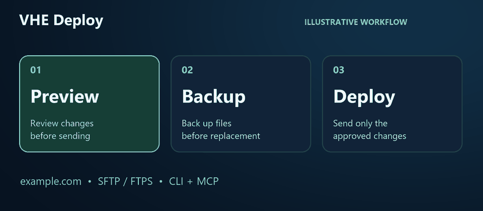

# VHE Deploy — SFTP/FTPS deployment CLI & MCP server

[English](README.en.md) · [Downloads](https://github.com/herlonventura/vhe-deploy-sftp-ftps-mcp/releases) · [Licença MIT](LICENSE)

**Atualize os arquivos do seu site com ajuda da IA: confira a prévia, autorize o envio e preserve uma cópia dos arquivos substituídos.**

[](docs/demo.md)

[Começar a instalação](#começar) · [Ver o vídeo de 42 segundos](docs/demo.md) · [Participar dos primeiros testes](https://github.com/herlonventura/vhe-deploy-sftp-ftps-mcp/discussions/1)

*Demonstração gráfica ilustrativa, com dados fictícios; não é uma gravação da interface de um aplicativo. Projeto em versão alpha: experimente primeiro em um site de teste.*

Deploy website files with an AI assistant or CLI: preview changes, create verified backups, and transfer files over SFTP/FTPS using Model Context Protocol (MCP).

Comandos oficiais: **`vhe-deploy`** e **`vhe-deploy-mcp`**. A marca identifica a ferramenta, sem limitar o provedor de hospedagem. [Mudança de nome e configuração](docs/vhe-deploy.md).

Gerencie arquivos de sites pelo **domínio completo cadastrado**: compare versões, gere uma prévia, faça backup e envie alterações verificadas. A implementação Python oferece CLI e servidor MCP local via **stdio**, com SFTP/FTPS, identidade do servidor validada, credenciais separadas da configuração e publicação desativada por padrão.

Pré-versão: **0.1.0a2**. [Pacotes portáteis e checksums](docs/releases.md). Gerencie sites em provedores com SFTP/FTPS compatíveis com os requisitos documentados; não administra painel de revenda, DNS, e-mail ou bancos de dados. Não há FTP sem criptografia na implementação Python.

A skill e os scripts PowerShell anteriores permanecem disponíveis, com suas dependências Windows/WinSCP/DPAPI: [guia legado](docs/legacy-windows.md). Instalar o Python não substitui essa skill automaticamente.

## Começar

Você pode passar o link deste repositório a uma IA com acesso ao computador e pedir: **“Leia a documentação e me ajude a instalar e configurar o VHE Deploy para um site de teste, sem publicar arquivos ainda.”** O assistente orienta o processo; a senha é digitada no terminal, nunca no chat. A integração depende dos recursos e permissões do aplicativo utilizado.

Requer Python 3.11+ e Git. Com pipx já instalado:

```sh
git clone https://github.com/herlonventura/vhe-deploy-sftp-ftps-mcp.git
cd vhe-deploy-sftp-ftps-mcp
pipx install .
vhe-deploy configurar
```

O assistente pergunta domínio, protocolo, servidor, porta, usuário, pastas e provedor da senha. Não depende de FileZilla. A senha é digitada em prompt oculto no terminal quando se usa keyring/age; nunca no chat, no YAML ou em argumento. Sem fingerprint SFTP confirmada ou cofre disponível, o cadastro permanece pendente. O assistente não conecta nem envia arquivos.

**Não há publicação no PyPI:** use o repositório ou o wheel dos artefatos; `pipx install vhe-deploy` sem um caminho não é o procedimento desta entrega.

- [Instalação por venv/pip e primeiro cadastro](docs/install.md)
- [pipx, Docker, binários e resultados do CI](docs/distribution.md)
- [Configuração MCP: Claude Desktop, Cursor, Zed, VS Code, Continue e Codex](docs/mcp-clients.md)
- [Migração da skill antiga: metadados, sem exportar senhas DPAPI](docs/migration-from-codex-skill.md)

## O que foi comprovado

[CI da pré-versão 0.1.0a2](https://github.com/herlonventura/vhe-deploy-sftp-ftps-mcp/actions/runs/36280611660): **sete jobs verdes**, Windows X64/Linux X64/macOS ARM64 com Python 3.11 e 3.14, mais Docker. Foram **498 testes por ambiente**, com cobertura de instruções e ramos entre **94,96% e 95,26%**. Testes adicionais verificaram pip/pipx, os novos comandos e binários PyInstaller, com prévia CLI, envio MCP, backup e rejeição de token reutilizado contra SFTP/FTPS locais.

| Item | Evidência e limite |
|---|---|
| CLI e MCP stdio | Cliente oficial do SDK, processos reais e servidores locais SFTP/FTPS |
| Windows, Linux e macOS | Matriz executada; outras versões/arquiteturas e WSL não foram testados |
| Credenciais age | Criptografia real com identidades temporárias |
| Cofres nativos | Cofre real Windows validado com credencial fictícia e MCP instalado; Linux/macOS simulados |
| Aplicativos de IA | Codex App Server reconheceu as sete ferramentas; interfaces e aprovações ainda não homologadas |
| Docker | Build, usuário não-root, CLI, age e MCP stdio; sem deploy a hospedagem real |
| Falhas e recuperação | Concorrência, processo interrompido, registro parcial, backup preservado e retomada com conflito |
| Ensaio operacional posterior | Envio, download e restauração em SFTP real com hashes e backups conferidos; [limites](docs/releases.md#verificação-operacional-adicional) |

[Detalhes dos testes](docs/testing.md) · [Matriz de distribuição](docs/distribution.md) · [Registro das oito etapas e pendências](docs/migration-plan.md).

[Validação adicional Windows/Codex](docs/validation-windows-codex.md): backup automático somente dos arquivos substituídos, envio de arquivo novo, token sem reutilização e remoção da credencial temporária. A [retenção automática](docs/retention.md) mantém os três últimos envios concluídos por domínio, preservando backups completos e falhas. Comparação por hash ainda exige leitura dos arquivos remotos.

## Usar a CLI

```sh
vhe-deploy list
vhe-deploy info exemplo.com.br
vhe-deploy test exemplo.com.br
vhe-deploy compare exemplo.com.br
vhe-deploy backup exemplo.com.br
vhe-deploy preview exemplo.com.br
```

`list` e `info` leem configuração local; as demais ações acima acessam o servidor. Execute somente a ação pretendida para o domínio correto. Aliases: `listar`, `configurar`, `testar`, `comparar`, `previa`, `enviar` e `migrar`. [Opções, códigos de saída e fluxo completo](docs/cli.md).

Cada cadastro fixa pasta local e raiz remota. Por padrão, configuração e estado ficam em `~/.vhe-deploy`. Use `--sites`, `--settings` e `--state-dir` antes do subcomando para caminhos próprios. Não coloque essas pastas dentro da publicação ou do Git.

Para enviar, é necessário habilitar conscientemente `publish_enabled` no site **e** nas configurações globais, gerar a prévia e revisar o plano. Somente depois da autorização:

```text
vhe-deploy deploy exemplo.com.br --preview-hash HASH_DA_PREVIA --preview-token TOKEN_DA_PREVIA --confirm
```

Os marcadores devem ser substituídos pelo resultado da prévia; não são valores utilizáveis. O token vale **cinco minutos**, é vinculado ao domínio/plano e tem uso único. Não o publique em Git/logs/scripts. Mudança no plano bloqueia o envio. Token e `confirm` não provam consentimento humano: o cliente continua responsável por respeitar a autorização do usuário.

## Usar com uma IA

O cliente inicia **`vhe-deploy-mcp`** e se comunica pelo stdin/stdout. Não existe porta HTTP/SSE nem configuração universal para todos os aplicativos. Os [exemplos por cliente](docs/mcp-clients.md) usam caminhos absolutos e não contêm senhas.

| Ferramenta | Operação |
|---|---|
| `list_sites` | Lista metadados locais |
| `test_connection` | Autentica e confere a raiz remota |
| `compare_site` | Compara conteúdo e datas |
| `preview_deploy` | Gera plano, hash e token quando não há bloqueios |
| `backup_site` | Baixa arquivos e verifica hashes |
| `deploy_site` | Envia a prévia autorizada com hash, token e confirmação |
| `register_site` | Cria cadastro novo desativado, sem senha nem confiança de identidade |

O formato operacional é `{status, data, messages}`, com `success`, `conflict`, `partial` ou `error`. A IA deve apresentar a prévia, preservar as aprovações do cliente e examinar falhas antes de tentar novamente. O MCP não recebe senha nem permite habilitar publicação/confiança pelo cadastro. [Contrato MCP](docs/mcp-setup.md).

`/mcplocaweb/dominio.com.br` é uma convenção da skill legada, não um comando de barra universal fornecido pelo servidor MCP.

## Proteções e limites

- Fingerprint SSH confirmada antes de autenticar; FTPS valida TLS no controle e nos dados. Não há aceitação automática de chave ou modo TLS inseguro.
- Segredos ficam no provedor explicitamente escolhido: keyring, age ou ambiente, sem fallback automático. Ambiente é texto em memória; não é criptografia.
- Arquivos bloqueados incluem `.env`, chaves, `wp-config.php`, `.git` e backups. Regras adicionais não retiram bloqueios mínimos. Isso não detecta todos os segredos embutidos em HTML/JS.
- Arquivo diferente com data remota igual/mais recente, incluindo tolerância de dois segundos, bloqueia o lote. Não existe `--force` para ignorar conflitos.
- Todos os originais a substituir são copiados/verificados antes do primeiro upload. Cada envio é lido novamente para conferir SHA-256. Arquivos só remotos são preservados; não há exclusão remota.
- A publicação escreve no arquivo ativo, sem transação por site ou rollback automático. Leitores podem observar conteúdo parcial; travas locais não bloqueiam outras máquinas/aplicações. FTPS exige condições administrativas adicionais.
- Backup cobre arquivos, não banco de dados, permissões ou snapshot simultâneo. Em `partial`, timeout ou interrupção, siga [recuperação](docs/recovery.md); repetir o comando não equivale a restaurar.
- No Windows, arquivos privados herdam ACLs, que esta ferramenta não configura/audita. Proteja cadastros, chaves, snapshots, recibos, backups e logs. Não sincronize o estado de autorização entre máquinas.

[Configuração e credenciais](docs/configuration-credentials.md) · [Limites dos transportes](docs/backends.md).

## Desenvolvimento

Em um venv, instale `requirements-dev.txt`. A suíte usa servidores em loopback, credenciais fictícias e pastas temporárias:

```sh
python -m pip install -r requirements-dev.txt
python -m pytest -q --ignore=tests/test_distribution.py --cov=vhe_deploy --cov-branch --cov-fail-under=81
```

Para os testes criptográficos, instale age/age-keygen ou configure `VHE_DEPLOY_TEST_AGE`; sem eles, há skips. Os testes de distribuição precisam dos comandos empacotados e rodam separadamente pelo procedimento em [distribuição](docs/distribution.md). Não execute testes contra cadastros reais.

A documentação da etapa 8 não executou migração de produção nem configurou aplicativos locais. A validação adicional cobriu o cofre real Windows e a descoberta no Codex App Server. PyPI, homologação das interfaces dos aplicativos, cofres reais Linux/macOS permanecem pendentes; não confunda a conclusão das oito etapas com essas validações adicionais.

## Dados privados e licença

Revise o diff antes de publicar: nunca inclua cadastros reais, credenciais, `.dpapi`, `.age`, identidades, recibos de token, exportações FileZilla, conteúdo de clientes, logs ou backups. `.gitignore` é uma ajuda, não garantia contra vazamentos.

Licenciado sob a [MIT](LICENSE), copyright 2026 Herlon Ventura. Uso, modificação e redistribuição são permitidos conforme seus termos. As dependências mantêm suas próprias licenças.
